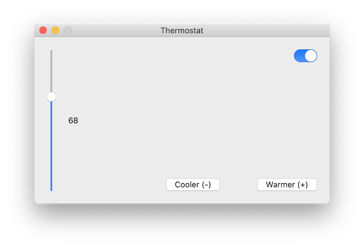

## KVC, KVO and Bindings

This tutorial is based on [Aaron Hillegass - Cocoa Programming for OS X: The Big Nerd Ranch Guide](https://www.oreilly.com/library/view/cocoa-programming-for/9780134077130/)

The original tutorial was written for Xcode 6.3 and  Swift 1.2. I have updated for Xcode 11.5 and Swift 5.2. All credits must go to the original authors.

Tutorial can be found [here](https://kicsipixel.github.io/2020/kvc/)